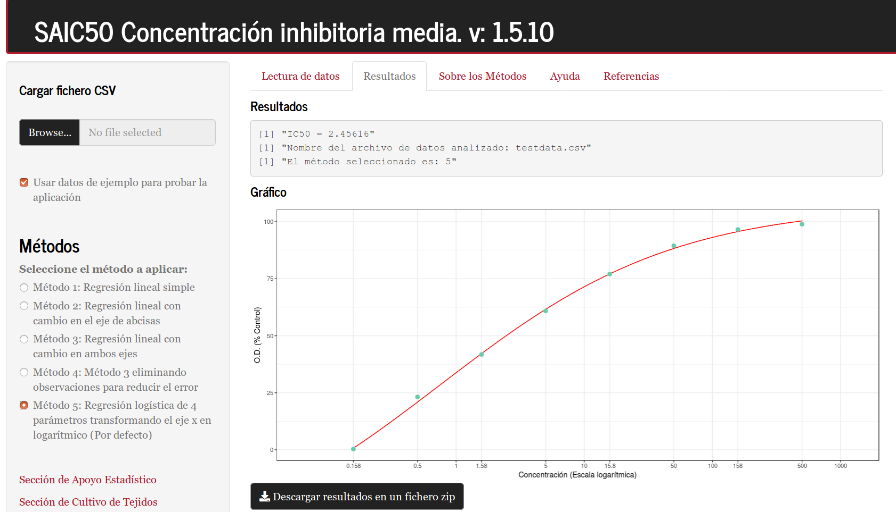
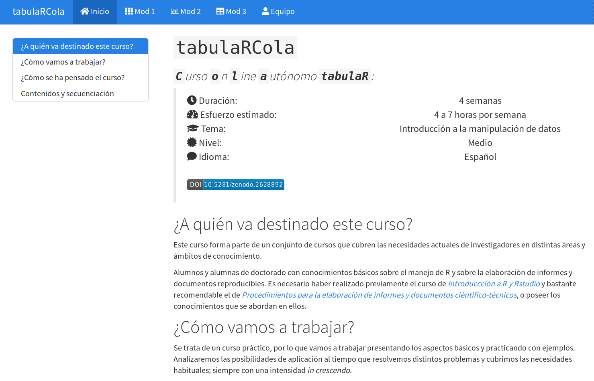
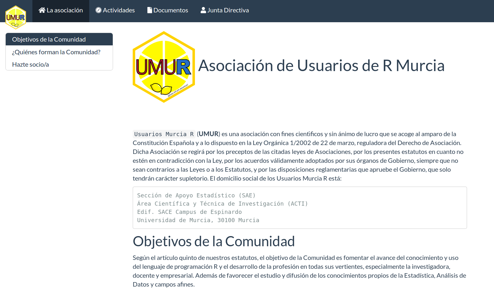



Shiny apps
======

[Energy consumption prediction (spanish)](http://gauss.inf.um.es:8080/predCONS/) &nbsp; &nbsp; &nbsp; [IC50 calculation (spanish app)](http://gauss.inf.um.es:8080/IC50/)

<a href="http://gauss.inf.um.es:8080/predCONS/"> &nbsp; &nbsp; &nbsp; &nbsp; <a href="http://gauss.inf.um.es:8080/IC50/">

Teaching
======
[R online course (spanish)](http://gauss.inf.um.es/tabular/)

<a href="http://gauss.inf.um.es/tabular/">

Community
======
[UMUR: R users association in Murcia (spanish)](http://gauss.inf.um.es/umur/)

<a href="http://gauss.inf.um.es/umur/">
